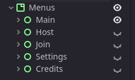

+++
title = 'How I made the main menu for my Godot game'
date = 2025-05-24T08:01:26-04:00
draft = true
tags = ['godot', 'hyper8']
thumb = 'old.png'
+++

<!-- put a video of the final product here -->

# What we're replacing...



So far the main menu has been purely functional, only implementing the bare minimum so I could focus on making the game playable first. Now that my game is ready for play testing with some friends, I wanted to redesign the main menu to reflect the overall direction of the game.

# A rough sketch

I've been on a Y2K kick recently and wanted to do something abstract. I also don't have any assets made for the game yet that I could reuse so simple shapes and gradients will do for now.



I started out with a rough sketch of what I wanted in Affinity Designer. It took me a while of tweaking until I was satisfied enough with the concept to start making it in Godot.

# 3D Background

I knew I wanted the background to be 3D and animated with the camera changing positions for different menus. I started by making a typical `ViewportContainer > SubViewport > Camera3D` setup and adding a sphere mesh for the camera to look at. I set the SubViewport Debug Draw mode to wireframe to get that grid effect on the sphere. The problem is I'm using the compatibility renderer so I can export the game to web and it doesn't support fancy things like rendering a viewport in wireframe mode. 

After searching around I found [this shader](https://godotshaders.com/shader/wireframe-shader/) posted by Melisek on godotshaders.com. This shader emulates the wireframe look in the fragment shader using barycentric coordinates. I'm not going to pretend I understand how it really works so you can read the original article Melisek used to make it here: https://wunkolo.github.io/post/2022/07/gl_ext_fragment_shader_barycentric-wireframe/

